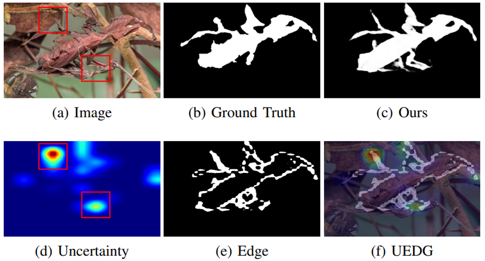
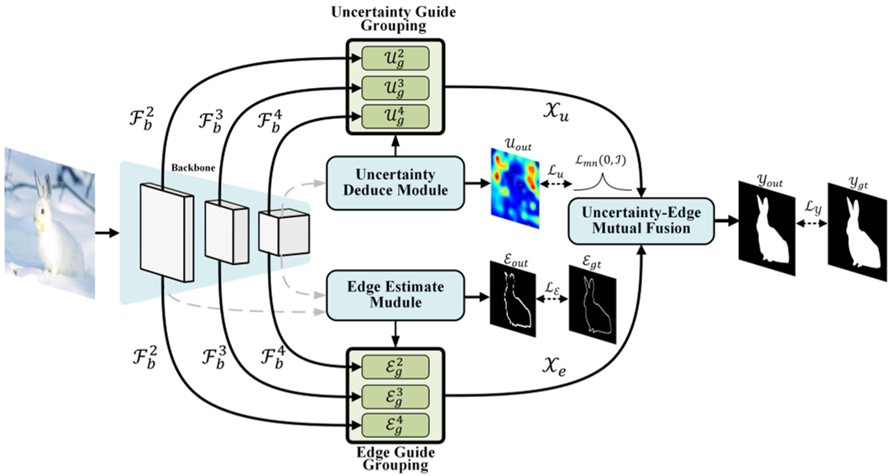

#  UEDG:Uncertainty-Edge Dual Guided Camouflage Object Detection

__Title:__ Uncertainty-Edge Dual Guided Camouflage Object Detection  
__Paper link:__ Early access version avalible [here](https://ieeexplore.ieee.org/document/10183371).

## 1. News
[2023-07-11] Code and corresponding data is uploaded with user guide.   
[2023-07-03] Paper has been accepted by IEEE Transaction on Multimedia. :partying_face: Congradulations!!! :partying_face:  
[2023-05-27] Detection results on four dataset: CHAMELEON, CAMO, COD10K-test, and NC4K are avilible: [Drive](https://bhpan.buaa.edu.cn/link/AA57817C2D29C54E1384AD71AE2F9487DF) or [Baidu Netdisk](https://pan.baidu.com/s/1tUQ41eoah9vMCPDg_Ytg7Q)(9cu6).  
[2023-05-26] Initial repository.  
[2022-11-22] Manuscript uploaded.

## 2. Features

      
    <em> 
    Figure 1: In this paper, we present the visualization results of the edge and uncertainty guidance operation in a highly challenging scenario. The red boxes indicate regions where the indistinguishable parts yield higher uncertainty scores. By incorporating edge information, our UEDG (Uncertainty Edge Guidance) approach achieves favorable performance.
    </em>

- **Novel multi-task guided framework.** We propose a novel structure that can combine multiple prior (uncertainty and edge in UEDG) for backbone feature guidance.

- **Powerful feature fusion strategy.** We employed Uncertainty-Edge
Mutual Fusion (UEMF), Uncertainty Deduce Module (UDM), Edge Estimate Module (EEM), and  Uncertainty/Edge Guide Grouping (UGG/EGG) module with in a powerful end-to-end formation.

- **SOTA results.** Our proposed method achieve the SOTA performance under four metrics in CHAMELEON, CAMO, COD10K, and NC4K. We also achieve the best performance in medical application like polyb segmentation as well.

## 3. Overview

      
    <em> 
    Figure 2: UEDG strucuture overview.
    </em>

      
    <em> 
    Figure 3: UEDG strucuture overview.
    </em>

      

## 4. Usage
### 4.1. Requirements
    conda create -n UEDG python=3.8
    conda activate UEDG
    pip install -r ./requirements.txt

For cuda11.6:

    conda install pytorch==1.12.1 torchvision==0.13.1 torchaudio==0.12.1 cudatoolkit=11.6 -c pytorch -c conda-forge
    
### 4.2 Data Preparation
+ downloading testing dataset and move it into `./dataset/TestDataset/`, which can be found in [Drive](https://bhpan.buaa.edu.cn/link/AA57817C2D29C54E1384AD71AE2F9487DF).
+ downloading training dataset and move it into `./dataset/TrainDataset/`, which can be found in [Drive](https://bhpan.buaa.edu.cn/link/AA57817C2D29C54E1384AD71AE2F9487DF).
<!-- + downloading pretrained weights `Net_epoch_best.pth` and move it into `./log/Mytrain/`, which can be found in [GoogleDrive](https://drive.google.com/file/d/1PD2mexy-IwnyWsb7WF59V1VAF24UKOcu/view?usp=sharing). -->
+ preparing the pvt weights on PVT(Pyrimid Vision Transformer) refer to [Drive](https://bhpan.buaa.edu.cn/link/AA57817C2D29C54E1384AD71AE2F9487DF) and move it into `./pre_trained/`.

### 4.2. Training
    python MyTrain.py
### 4.3. Testing
    python MyTest.py

## 5. Thanks
Code copied a lot from [HVision-NKU/CamoFormer](https://github.com/HVision-NKU/CamoFormer), [thograce/BGNet](https://github.com/thograce/BGNet.git), [weijun88/F3Net](https://github.com/weijun88/F3Net), [HUuxiaobin/HitNet](https://github.com/HUuxiaobin/HitNet.git), [GewelsJI/DGNet](https://github.com/GewelsJI/DGNet.git), [clelouch/BgNet](https://github.com/clelouch/BgNet.git), [fanyang587/UGTR](https://github.com/fanyang587/UGTR.git), [whai362/PVT](https://github.com/whai362/PVT.git). Thanks for their great works!

## 6. License
The source code is free for research and education use only. Any commercial usage should get formal permission first.

## 7.Citation
    @ARTICLE{10183371,
    author={Lyu, Yixuan and Zhang, Hong and Li, Yan and Liu, Hanyang and Yang, Yifan and Yuan, Ding},
    journal={IEEE Transactions on Multimedia}, 
    title={UEDG:Uncertainty-Edge Dual Guided Camouflage Object Detection}, 
    year={2023},
    doi={10.1109/TMM.2023.3295095}}
